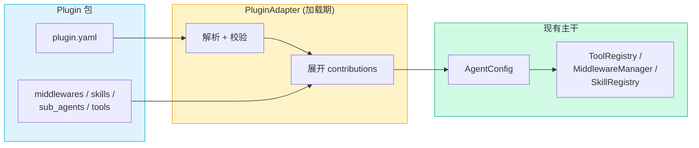

# RFC-0024: Agent Plugin 适配层

- **状态**: draft
- **优先级**: P1
- **标签**: `architecture`, `dx`, `security`, `mcp`, `middleware`, `skills`
- **影响服务**: `nexau/archs/main_sub/`, `nexau/archs/tool/`, `docs/`, `tests/`
- **创建日期**: 2026-05-07
- **更新日期**: 2026-05-13

## 摘要

NexAU 已具备构建 plugin 所需的底层能力 (MCP / Skill / Middleware / sub-agent / ToolSearch / LoadSkill),缺的是 "一个本地能力包如何被识别并展开成 AgentConfig" 的适配层。本 RFC 引入 `plugin.yaml` manifest + `PluginAdapter`,plugin 在加载期被解析为现有 `mcp_servers / middlewares / skills / sub_agents / tools`,runtime 主干不变。

核心选择:

1. 分工借鉴 ESLint —— plugin 是能力包,agent YAML 负责启用和传参;
2. manifest 结构借鉴 VSCode extension —— `engines` + `config` + `contributes`;
3. 工具按需加载 (ToolSearch),技能渐进加载 (LoadSkill);
4. plugin 在同一 agent 内**单实例**,多租户/多源由 plugin 内部抽象解决;
5. 命名冲突 fail-fast,不做自动 prefix / alias / on-off。

## 动机

NexAU 已经有的能力 (`mcp_servers` / `skills` / `middlewares` / `sub_agents` / `ToolSearch` / `LoadSkill`) 已经够多,但每个能力都是独立 YAML 入口。当用户想要 "客服业务能力包"、"政务问答包" 这种业务切片时,只能复制粘贴 YAML 片段,没有可分发、可组合、命名冲突可控的打包单元。

不做的后果:plugin 生态退化成 "复制 YAML",最终用户无法组合大量能力;MCP tool 数量增长后 `ToolSearch` 能省 token 但用户不知道该启用什么;能力分散在不同入口,无法作为可组合单元交付。

2026-05-08 讨论确认第一阶段优先覆盖平台可控的 plugin (而非完整第三方生态),需要:

1. Agent 功能组合 —— 配置组合工具 / MCP / middleware / skill / sub-agent;
2. 平台内置类型优先 —— 等模型稳定后再考虑第三方分发;
3. 前端表单生成 —— plugin 在 `plugin.yaml` 内声明入参 schema,前端据此渲染 form;
4. Runtime 拼接 —— agent YAML 只声明 plugin 路径和参数,运行时由 adapter 拼接。

## 设计

### 目标

1. 定义稳定的 `plugin.yaml` manifest 契约,结构借鉴 VSCode extension;
2. `PluginAdapter` 把 plugin contributions 映射到现有 `AgentConfig`,runtime 主干不变;
3. plugin 参数 schema 既驱动 adapter 校验,也供前端渲染表单;
4. `use:` 字段统一 scheme 形式 (Phase 1 仅 `path:`),为未来远程 plugin (registry / git / archive) 预留扩展点。

### 非目标

1. 不替代 MCP,不自研工具 RPC;
2. 不做 plugin store / marketplace / 安装 CLI;
3. 不在第一阶段实现:plugin pack (`extends`)、activation events、跨 plugin 引用 (`${config.<other>.*}`)、MCP discovered tool 的 per-call 参数注入、partial load、远程 `use:` scheme;
4. 不支持同一 plugin 在同一 agent 内多次实例化 (无 alias / 多实例);
5. 不扩展 `SubAgentConfigEntry` schema (不引入 sub-agent params 透传,该 schema 演化是独立议题,见 [schema.py:39](https://github.com/china-qijizhifeng/nexau/blob/main/nexau/archs/main_sub/config/schema.py#L39) 的 `TODO(hanzhenhua)`);
6. plugin 不能 contribute `tracers / token_counter / before_*_hooks / after_*_hooks` (application-level 配置不在 plugin scope);
7. 不在第一阶段设计权限、secret、sandbox enforcement;
8. 不把联网代理方案纳入本 RFC。

### 概述



Plugin 只在加载期存在,展开后转为现有 `system_prompt_suffix / mcp_servers / middlewares / skills / sub_agents / tools`,runtime 不感知 plugin。

### 关键决策

| # | 决策 | 理由 |
|---|---|---|
| 1 | Plugin 是加载期概念,展开后 runtime 不感知 | 避免扩大 runtime primitive 状态面 |
| 2 | manifest 借鉴 VSCode 风格 (`engines` / `config` / `contributes`) | plugin.yaml 是新文件无现状包袱;`contributes` 段清晰收拢扩展点;`config.properties` ↔ agent yaml `plugins[].config` 语义对应 VSCode `contributes.configuration` ↔ `settings.json`,但字段名更短且贴近 NexAU 现有命名 |
| 3 | `contributes.*` 内部字段沿用 nexau 现状 (`yaml_path` / `binding` / `extra_kwargs` / `type` / `command` / `args` / `config_path` / `import`) | adapter 直接喂给现有 loader,不引入新内部 schema |
| 4 | 工具按需加载 (`ToolSearch`),技能渐进加载 (`LoadSkill`) | plugin 数量不可控,全量进 LLM payload 会爆 |
| 5 | 单实例:同一 `use:` 值在同一 agent yaml 内重复 → fail-fast | 多实例引入 trace / 命名空间 / MCP 进程 / prompt 拼接的运行时复杂度;多租户/多源由 plugin 内部抽象解决 |
| 6 | sub-agent YAML 中的 `plugins` 字段加载时静默忽略 | plugin 命名空间永远单层,避免嵌套 scope / 循环引用 / MCP server N 倍化 |
| 7 | `use:` 统一 scheme 化 (`<scheme>:<body>`);Phase 1 仅 `path:`(resolver: 直接用给定路径) | 未来远程 plugin (`pkg:` / `git+https:` / `https:`) 不破坏 Phase 1 配置;`use:` 命名表达"resolver strategy"维度 |
| 8 | 冲突 fail-fast,不做自动 prefix / alias / on-off | 第一阶段保持简单,Phase 2 再补开关 |
| 9 | plugin manifest 变量统一用点号形式 (`${config.project_id}`) | 与 agent yaml 侧 `${env.NAME}` / `${variables.foo}` 保持一致,避免在 YAML 场景里混用冒号造成歧义 |
| 10 | plugin 顶层可声明唯一 `system_prompt_fragment`,由 adapter 追加到现有 `system_prompt_suffix` | 该字段不是资源集合,顶层字段更直接;允许 plugin 声明必须 always-on 的行为约束,同时复用现有 prompt suffix 机制,不改变 `system_prompt_type: file/jinja` 的路径语义 |

## 详细设计

### Plugin 包结构

```text
my-plugin/
├── plugin.yaml                          # 必须
├── middlewares/<file>.py
├── skills/<name>/SKILL.md
├── sub_agents/<name>.yaml
└── tools/<name>/
    ├── <name>.tool.yaml
    └── handler.py
```

最小目录只需要 `plugin.yaml`。其他文件只有被 manifest 字段明确引用时才会被 adapter 读取。

> 注:顶层 `system_prompt_fragment` 是 always-on prompt,每个 plugin 最多一个,适合插件必须声明的 persona / 使用约束 / 安全边界。可按需加载的大段知识仍推荐放在 `contributes.skills[*]`,避免每轮对话都承担不必要 token。

### plugin.yaml manifest

```yaml
type: plugin
name: north.customer-service             # 全局唯一,推荐反向域名或 scoped
version: "1.0.0"
description: 客服业务能力包

engines:
  nexau: ">=0.3.0,<0.5.0"                # NexAU 版本兼容范围

config:
  properties:
    project_id:
      type: string
      required: true
      description: Project ID
    region:
      type: string
      enum: [shanghai, beijing]
      default: shanghai
    limit:
      type: integer
      default: 8

system_prompt_fragment: |
  You are using the customer-service plugin for ${config.region}.
  Follow the escalation and audit policy from this plugin.

contributes:
  mcp_servers:                            # 字段集 = AgentConfigSchema.mcp_servers
    - name: customer-service/runtime
      type: stdio
      command: uv
      args: ["run", "${plugin.dir}/tools/runtime_server.py"]
      env:
        REGION: ${config.region}

  tools:                                  # 字段集 = ToolConfigEntry
    - name: query_order
      yaml_path: ${plugin.dir}/tools/query_order/query_order.tool.yaml
      binding: tools.query_order.handler:query_order
      extra_kwargs:
        project_id: ${config.project_id}

  skills:                                 # name + path (path 须含 SKILL.md)
    - name: customer-service/main
      path: skills/main

  sub_agents:                             # 字段集 = SubAgentConfigEntry
    - name: escalation
      config_path: sub_agents/escalation.yaml

  middlewares:                            # 字段集 = HookImportConfig + name
    - name: customer-service/audit
      import: ./middlewares/audit.py:AuditMiddleware
      params:
        project_id: ${config.project_id}
```

#### 顶层字段

| 字段 | 必需 | 说明 |
|---|---|---|
| `type` | 否 | 固定 `plugin`,跟 `type: agent` 对称 |
| `name` | 是 | plugin ID,全局唯一 |
| `version` | 是 | semver |
| `description` | 否 | 前端表单 / 报错使用 |
| `engines.nexau` | 是 | NexAU 版本范围 (semver range) |
| `config.properties` | 否 | 参数 schema,见 §参数 |
| `system_prompt_fragment` | 否 | plugin 的唯一 always-on prompt 片段,渲染后追加到最终 `system_prompt_suffix` |
| `contributes` | 否 | plugin 贡献的能力集合 |

#### `contributes` 段

| 字段 | 复用的现有 schema | 路径约束 |
|---|---|---|
| `mcp_servers[]` | `AgentConfigSchema.mcp_servers` 的 `MCPServerConfig` (name / type / command / args / url / headers / env / timeout / disable_parallel / permissions / tool_permissions) | `args` 内可用 `${plugin.dir}` `${config.*}` |
| `tools[]` | `ToolConfigEntry` (name / yaml_path / binding / lazy / as_skill / defer_loading / extra_kwargs) | `yaml_path` 指向 plugin 内 tool YAML,可使用相对路径或 `${plugin.dir}` |
| `skills[]` | `{ name, path }` | path 须含 `SKILL.md`,plugin 根目录内 |
| `sub_agents[]` | `SubAgentConfigEntry` (name / config_path) | config_path 须在 plugin 根目录内;指向的 sub-agent YAML 不开放 `${plugin.dir}` |
| `middlewares[]` | `HookImportConfig` (import / params) + `name` (用于冲突检测) | `import` 可用 plugin 内相对 Python 文件 |

#### 通用约束

- 所有路径相对 plugin 根目录,不能越出;
- 不接受绝对路径 `command`,本地脚本用 `${plugin.dir}` 引用;
- plugin 内仅支持两个变量 namespace:`${plugin.dir}` (plugin 包绝对根目录) 和 `${config.<name>}` (manifest `config.properties` 中已校验的参数值);
- `${plugin.dir}` 用于机器路径字段 (如 MCP `args`、tool `yaml_path`),不建议写入 `system_prompt` 等面向模型的文本;
- plugin-contributed sub-agent YAML 必须是完整可复用的 agent YAML,只允许注入 `${config.<name>}`,不允许引用 `${plugin.dir}`;
- `${config.<name>}` 引用未声明参数 → fail-fast;
- `${config.<name>}` 作用域只在当前 plugin 内,不能引其他 plugin 的 config。

### `use:` 字段

agent yaml 通过 `plugins[].use: <scheme>:<body>` 引用 plugin。scheme 表达 **resolver strategy** (用什么策略解析到本地 plugin 根目录),不是位置标签。

Phase 1 **只支持** `path:` scheme,且 YAML 中建议始终给 `use` 值加引号,避免 `:` 被误读为 YAML 结构。

| Scheme | Resolver | body |
|---|---|---|
| `path:` | 不 resolve,直接用给定路径 | 相对路径 (`./` `../`,相对 agent yaml 所在目录) 或绝对路径 (`/`) |

其他 scheme (`pkg:` / `git+https:` / `https:` 等) Phase 1 报错:`Plugin URI scheme '<scheme>' is not supported in Phase 1`。具体设计留独立 RFC。

### Agent YAML 启用

```yaml
type: agent
name: support_agent
llm_config:
  model: gpt-4o-mini
plugins:
  - use: "path:./plugins/north.customer-service"
    config:
      project_id: "proj_xxx"
      region: shanghai
      limit: 8
```

启用语义:**全量注入**。manifest 中声明的所有 `contributes.*` 都进入最终 `AgentConfig`,不支持 per-capability `on/off`、alias 或部分启用。

#### 变量解析两层

1. **agent yaml 侧**:`plugins[].config` 的值可使用现有 `${env.NAME}` / `${variables.foo}`,先解析后进入 plugin 参数校验;
2. **plugin manifest 侧**:adapter 校验得到 `resolved config` 后,渲染 manifest 内的 `${config.<name>}` 和 `${plugin.dir}`;plugin-contributed sub-agent YAML inline 渲染时只注入 `${config.<name>}`。

凭证类参数建议走 `${env.NAME}` 注入,不要写入 prompt 或 command args。

#### 变量表

Phase 1 只开放下表变量。新增顶层变量 namespace 前必须先更新本表,避免实现和文档各自扩散。

| 阶段 | 表达式 | 来源 | 作用域 | 说明 |
|---|---|---|---|---|
| agent yaml 预处理 | `${env.NAME}` | `os.environ["NAME"]` | agent YAML 全文 (含 `plugins[].config`) | 现有配置加载能力,缺失环境变量 fail-fast |
| agent yaml 预处理 | `${variables.foo.bar}` | agent YAML 顶层 `variables` 映射 | agent YAML 全文 (含 `plugins[].config`) | 现有配置加载能力,仅支持 scalar 值嵌入;解析后 `variables` 不进入 `AgentConfig` |
| plugin manifest 渲染 | `${plugin.dir}` | `use:` resolver 得到的 plugin 包绝对根目录 | 当前 plugin 的 `plugin.yaml` contributions | 用于引用 plugin 内脚本 / 文件;adapter 仍需做路径越界检查;不注入 sub-agent YAML |
| plugin manifest 渲染 | `${config.<name>}` | 当前 plugin 已校验的 `plugins[].config` + manifest default | 当前 plugin 的 `plugin.yaml` contributions 及 plugin-contributed sub-agent YAML inline 渲染 | `<name>` 必须声明在当前 manifest `config.properties`;不能引用其他 plugin |

明确不开放:

- `${workspace.*}` / `${rootDir}` / `${cwd}`: Phase 1 不引入 workspace 语义,避免本地 CLI、云端 artifact、sub-agent 嵌套时含义不一致;
- `${agent.*}`: agent metadata 不注入 plugin manifest,避免 plugin 对宿主 agent 结构产生隐式依赖;
- `${this_file_dir}`: 这是现有 agent YAML loader 的历史占位符,不作为新的 plugin manifest 变量契约。

### 参数 schema

`config.properties` 语义借鉴 VSCode `package.json contributes.configuration`,既驱动 adapter 校验,也供前端表单渲染。

| 字段 | 说明 |
|---|---|
| `type` | `string` / `integer` / `number` / `boolean` / `string_array` |
| `required` | 是否必须由 `plugins[].config` 显式提供 |
| `default` | 未传值时的默认值,需符合 `type` |
| `description` | 前端表单和报错文案,不进 prompt |
| `enum` | 字符串枚举,仅对 `string` 生效 |

参数进入运行时的受控路径:

| 目标 | 用途 | 注入位置 |
|---|---|---|
| MCP server `env` / `args` | 启动期参数 | `contributes.mcp_servers[*]` |
| tool `extra_kwargs` | 固定 tool 参数,模型不可改写 | `contributes.tools[*]` (跟现状 `ToolConfigEntry.extra_kwargs` 语义一致) |
| middleware `params` | runtime 扩展配置 | `contributes.middlewares[*]` (跟现状 `HookImportConfig.params` 语义一致) |

注入到 tool `extra_kwargs` 的 key 不应同时出现在该 tool 的 `input_schema` 中;若同名,adapter fail-fast。

### Sub-agent 处理

#### sub-agent YAML 中的 `plugins` 字段 → 静默忽略

无论 sub-agent YAML 是 plugin 自带 (via `contributes.sub_agents`) 还是 agent yaml 直接 declare (via top-level `sub_agents`),其内部的 `plugins` 字段在 sub-agent 加载时:

- 不报错;
- 不展开 contributions;
- 一份 YAML 既能当 main agent 又能当 sub-agent;
- adapter 加载时若发现 `plugins` 非空,记一条 INFO 级 log (`sub_agent_load plugins_ignored=<n>`),方便排查"配置了为什么没生效"。

理由:plugin 命名空间永远单层,避免嵌套 scope、循环引用、MCP server N 倍化、trace 加 plugin agent path 维度。

#### plugin-contributed sub-agent 的 config 注入

`contributes.sub_agents[*].config_path` 指向的 YAML 是 plugin 内部文件。adapter 展开时把已校验的 plugin `resolved config` 注入解析上下文,**inline 渲染**所有 `${config.<key>}`,再喂给 `AgentConfig.from_yaml()`。sub-agent YAML 不注入 `${plugin.dir}`,以保持文件本身是完整可复用的 agent YAML,避免把 plugin 安装目录泄漏进子 agent 语义。**不依赖** `SubAgentConfigEntry` schema 变更。

#### agent yaml 直接 declare 的 sub-agent → Phase 1 不支持引用 plugin config

main agent yaml 中 `sub_agents[].config_path` 指向用户独立写的 YAML 时,Phase 1 不支持该 sub-agent 引用 main 启用的 plugin config。原因:当前 `SubAgentConfigEntry` (`extra="forbid"` + 仅 `name + config_path`) 不支持 params 透传,该 schema 演化是独立议题 ([schema.py:39](https://github.com/china-qijizhifeng/nexau/blob/main/nexau/archs/main_sub/config/schema.py#L39) 已有 TODO),本 RFC 不顺带处理。

需要让独立 sub-agent 使用 plugin 能力时,推荐把它通过 `contributes.sub_agents` 引入 (走 plugin-contributed 路径),或在 sub-agent YAML 内硬编码所需参数。

### 合并规则

| 原有字段 | plugin 如何合并 | 冲突 |
|---|---|---|
| `mcp_servers` / `skills` / `sub_agents` / `tools` | plugin 项全部追加 | 与本地或其他 plugin 同名 → fail-fast |
| `middlewares` | plugin 项按 `plugins[]` 顺序 + manifest 声明顺序展开,本地 YAML `middlewares` 追加在 plugin middleware 之后 | plugin middleware 同名 fail-fast |
| 顶层 `system_prompt_fragment` | plugin fragment 按 `plugins[]` 顺序追加到最终 `system_prompt_suffix`;本地 YAML `system_prompt_suffix` 放在 plugin fragment 之后 | — |
| `system_prompt` / `llm_config` / `sandbox_config` / `before_*_hooks` / `after_*_hooks` / `tracers` / `token_counter` | plugin 不能 contribute | — |

总原则:本地 YAML 显式定义永不被 plugin 静默覆盖;同名资源 fail-fast,不做自动 prefix。

### 加载错误策略

Phase 1 默认 strict fail-fast,并遵从现有 `AgentConfig.from_yaml(..., options=AgentConfigLoadOptions(strict=...))` 语义:

- `strict=True` (默认):plugin contribution 的资源路径解析 / 组件加载失败时抛 `ConfigError`;
- `strict=False`:plugin contribution 的资源路径解析 / 组件加载失败时记 warning,跳过失败的 contribution,并进入现有 `skipped_components` 摘要。

以下 contract / safety 错误不受 `strict=False` 影响,必须始终 fail-fast:

- `plugin.yaml` 不存在或 schema 不合法;
- `engines.nexau` 不满足当前 NexAU 版本;
- plugin 路径或内部路径越出 plugin 根目录;
- `plugins[].config` 缺必填、类型错或包含未知参数;
- `${config.<name>}` 引用未声明参数;
- tool / middleware / skill / sub-agent / MCP server 命名冲突;
- 同一 `use:` 值在同一 agent yaml 内重复 (违反单实例);
- `plugins[].use` 包含未支持 scheme;
- plugin 试图 contribute 不允许的字段 (`tracers` / `token_counter` / `before_*_hooks` / `after_*_hooks`)。

通用 partial load / graceful degradation 不在 Phase 1 范围;这里只保留现有 agent config loader 的 `strict=False` 兼容语义。

### 命名 / 冲突

核心原则:**plugin 资源在最终 `AgentConfig` 里的 name 完全等于 manifest `contributes.*.name` 写的值,adapter 不做任何自动改名或自动加前缀**。命名是 plugin 设计者的责任,不是 adapter 的 magic。

具体规则:

- `plugin.name` 必须全局唯一,**强烈推荐**反向域名或 scoped 形式 (`north.customer-service` / `north/customer-service`),便于将来跨组织共存;
- **Tool name**: plugin 设计者应保持简洁 (如 `query_order`),不建议在 manifest 里加 `<plugin>/` 前缀 —— tool name 直接暴露给模型,前缀是 prompt noise 且影响 tool 数量多时的体验;
- **Skill / Middleware / Sub-agent / MCP server name**: 是内部 registry key,**建议** plugin 设计者在 manifest 命名时就采用 `<plugin>/<resource>` 形式 (如 `customer-service/main`) 降低冲突概率;但这是 convention 不是 schema 强制,manifest 写 `main` 也能加载,plugin 设计者自己承担冲突责任;
- adapter **永远不自动加前缀**,manifest 写什么名字最终就是什么名字 —— 显式优于隐式,避免 trace / log / config 里出现跟 manifest 不一致的名字;
- 任何最终 name 冲突 (本地 vs plugin、plugin vs plugin) → fail-fast,错误信息包含冲突类型、双方 `source_id` (见 §Source ID 与 Observability) 和修复建议 (改 manifest name、改本地资源名,或不同时启用冲突 plugin);
- per-capability `on/off`、alias、自动 prefix 等冲突消解机制留到后续 RFC,第一阶段不引入。

### Source ID 与 Observability

`source_id` 是 adapter 自动生成的内部追溯标识,跟 resource name 解耦 —— 无论 resource name 是否带 `<plugin>/` 前缀,trace / log / debug 永远能追溯到来源 plugin。

格式:

```
source_id = plugin:<plugin_name>:<kind>:<resource_name>     # plugin 展开的资源
source_id = local:<kind>:<resource_name>                    # 本地 YAML 显式声明的资源
```

其中 `<kind>` ∈ { `tool`, `skill`, `middleware`, `sub_agent`, `mcp_server` };`plugin_name` 是 plugin manifest 顶层 `name`;`resource_name` 是 manifest `contributes.*[i].name` 或本地 YAML 中的对应字段。

约束:

- adapter 展开 contribution 时必须为每个资源附加 `source_id`,不依赖最终 resource name 是否带前缀;
- 本地资源 (非 plugin 展开) 也带 `source_id = local:<kind>:<name>`,保证字段在 plugin / 本地两种来源下**始终存在**,避免 conditional 字段;
- 集成现有 `nexau.archs.tracer`: tool span 的 `attributes["source_id"]` 必须填该 tool 的 source_id;agent / sub_agent span 的 `attributes["plugin_sources"]` 列出该 span 内被调用过的 plugin source_id 集合 (去重);
- 集成日志: plugin 相关 log 行带 `extra={"source_id": ...}`,便于 grep / filter "哪个 plugin 出的问题";
- `source_id` 是 ASCII 字符串,长度 ≤ 256;
- `source_id` **不暴露给模型** (不进 tool description / system prompt / tool_call_response),只用于 trace 和运维。

## 权衡取舍

| 替代方案 | 决定 | 理由 |
|---|---|---|
| 自研 plugin RPC / 只支持 MCP server / Plugin 作为新 runtime primitive | 否 | 重复造轮、表达力不够、状态面爆炸 |
| Manifest + adapter 到现有 AgentConfig | 采用 | 改动集中、复用主干、兼容旧配置 |
| 沿用 nexau flat 风格写 plugin.yaml | 否 | 缺扩展点,加新 contribution 要改顶层 |
| 允许 plugin 多实例 (alias) | 否 | 引入运行时 instance 维度,trace / 命名 / 进程 / prompt 复杂度爆炸 |
| sub-agent YAML 能 declare plugins | 否 | 嵌套 scope / 循环引用 / N 倍 MCP / trace 加 agent path |
| `plugins[].path` 裸用本地路径 | 否 | 未来加远程 source 改名是 breaking change |
| `use:` 统一 scheme 化 (`path:` 等) | 采用 | 解析逻辑统一,扩展点 cleaner,scheme 表达 resolver strategy 维度 |
| 自动把 MCP prompts 转 Skill | 否 | MCP prompts 偏用户主动选择,自动注入混淆语义 |

缺点:

- 工具按需加载首次使用多一轮 `ToolSearch`;
- middleware 进入运行链路,顺序和副作用问题靠显式冲突检测和保守启用边界控制;
- manifest schema 需尽早稳定,否则后续生态受 breaking change 影响;
- plugin.yaml (VSCode 风格) 跟 agent.yaml (flat) 风格不一致,但 plugin 是新概念,风格切换反向强化 mental model 边界。

## 实现计划

### Step 1: Schema 与 manifest 读取

- 在 `AgentConfigSchema` 增加 `plugins` 字段,子结构 `PluginEntryConfig { use, config }`;
- 新增 `nexau/archs/main_sub/plugin/manifest.py` (pydantic schema for `plugin.yaml`);
- 新增 `PluginAdapter`,`use:` 仅支持 `path:` scheme;
- 路径解析、`config.properties` 校验、`${env}` / `${variables}` / `${config.*}` / `${plugin.dir}` 解析;
- `PluginAdapter` 必须接收并传递 `AgentConfigLoadOptions.strict`,跟现有本地 tools / skills / sub_agents / hooks 加载失败策略一致;
- 确认 `AgentConfigSchema` 对 unknown top-level field `extra="forbid"`,保证旧版 NexAU 见 `plugins` 字段直接 fail-fast。

### Step 2: Contributions 展开

- 顶层 `system_prompt_fragment` 渲染后追加到现有 `system_prompt_suffix`,不直接改写 `system_prompt`;
- `contributes.{mcp_servers, tools, skills, sub_agents, middlewares}` 分别展开,字段集复用现有 schema;
- plugin-contributed sub-agent YAML 加载前 inline 渲染 `${config.<key>}`;
- sub-agent 加载路径忽略 YAML 内的 `plugins` 字段,记 INFO log;
- 本地 YAML 显式配置不被 plugin 覆盖,展开不写回磁盘。

### Step 3: 冲突 / metadata / 验证

- tool / middleware / skill / sub-agent / mcp_server 命名冲突 fail-fast;
- 单实例约束:同一 `use:` 值重复 → fail-fast;
- 未支持 scheme 给友好错误;
- 实现 §Source ID 与 Observability 段全部约束:adapter 给每个 plugin / 本地资源附加 `source_id`,tracer 在 tool span `attributes["source_id"]` / agent span `attributes["plugin_sources"]` 中暴露,plugin 相关 log 携带 `extra={"source_id": ...}`;
- 本地 fixture plugin 用于单元和集成测试。

### 后续 RFC 候选 (不在本 RFC 范围)

远程 `use:` scheme / per-capability `on/off` / alias / plugin pack (`extends`) / activation events / 跨 plugin `${config.<other>.*}` 引用 / MCP discovered tool 的 per-call 参数注入 / partial load / `SubAgentConfigEntry` params 透传。

## 测试方案

### 单元

- `plugins` schema 校验:缺 `use` / 未支持 scheme / 同 `use:` 重复 → fail-fast;
- `engines.nexau` 不匹配 → fail-fast;
- manifest 必填字段、未知字段、路径越界校验;
- `plugins[].config` 按 `config.properties` 校验:类型 / 必填 / 默认值 / enum / 未知参数;
- 两层变量解析顺序:agent yaml 侧 `${env}/${variables}` 先解析,plugin manifest 侧 `${config.*}` 后渲染;
- `${config.<name>}` 引用未声明参数 → fail-fast;
- plugin manifest 出现变量表外的 `${...}` → fail-fast;
- `PluginAdapter` 正确展开顶层 `system_prompt_fragment` 和 `contributes.{mcp_servers, tools, skills, sub_agents, middlewares}` 为现有 schema;
- `system_prompt_fragment` 与 agent `system_prompt` / `system_prompt_suffix` 按顺序合并,且在默认 system prompt 场景下同样生效;
- plugin-contributed sub-agent YAML 内 `${config.<key>}` 被 inline 渲染;
- `AgentConfigLoadOptions(strict=False)` 下,plugin contribution 的资源路径解析 / 组件加载失败会 warning + skip,但 manifest schema / engine / config 校验 / 命名冲突仍 fail-fast;
- sub-agent YAML 中 `plugins` 字段加载时不报错且不展开,记 INFO log;
- tool `extra_kwargs` 与 `input_schema` 同名 → fail-fast;
- plugin 试图 contribute `tracers` / `token_counter` / `before_*_hooks` / `after_*_hooks` → fail-fast;
- 命名冲突 fail-fast (本地 vs plugin、plugin vs plugin)。

### 集成

- fixture plugin 通过 agent yaml `plugins` 加载,验证 skill / sub-agent / middleware / MCP server / tool 全部能用;
- plugin tool 通过 `ToolSearch` 按需注入;
- plugin-contributed sub-agent 能引用父 plugin `${config.<key>}`;
- 同时启用两个 plugin + 一个本地 tool,断言:tool span 的 `attributes["source_id"]` 字段在所有三种来源下都存在 (不是 conditional);两个 plugin tool 的值以 `plugin:` 开头,本地 tool 的值以 `local:` 开头;agent span 的 `attributes["plugin_sources"]` 列出去重的 plugin source_id 集合;`source_id` 不出现在 tool description 或 tool_call_response 中;
- 同一 `use:` 在 agent yaml 内重复 → 加载失败。

### 手动

1. 准备本地 `north.customer-service` fixture plugin;
2. agent yaml 通过 `use: "path:./..."` + `config` 启用;
3. 跑一条需要该 plugin 能力的请求;
4. 验证 trace 中可看到 plugin / tool / middleware / sub-agent 来源。

## 相关文件

| 文件 | 改动 |
|---|---|
| `nexau/archs/main_sub/config/base.py` | `AgentConfigBase` 增加 `plugins` 字段 |
| `nexau/archs/main_sub/config/schema.py` | 新增 `PluginEntryConfig` (use + config);`AgentConfigSchema` 增加 `plugins` |
| `nexau/archs/main_sub/config/config.py` | builder 展开 plugin contributions |
| `nexau/archs/main_sub/plugin/manifest.py` | 新增 manifest schema |
| `nexau/archs/main_sub/plugin/adapter.py` | 新增 `PluginAdapter` |
| `docs/advanced-guides/skills.md` / `hooks.md` / `mcp.md` | 补 plugin 场景 |

## 参考资料

- [ESLint: Create / Configure Plugins](https://eslint.org/docs/latest/extend/plugins)
- [VSCode Extension Manifest](https://code.visualstudio.com/api/references/extension-manifest)
- [VSCode Contribution Points](https://code.visualstudio.com/api/references/contribution-points)
- [MCP 2025-06-18 Overview](https://modelcontextprotocol.io/specification/2025-06-18/basic/index)
- [RFC-0005: Tool Search](./0005-tool-search.md)
- [RFC-0006: 中性 Structured Tool Calling 与 Provider 延迟适配](./0006-neutral-structured-tool-calling.md)
- [RFC-0015: Sub-agent 配置加载](./0015-sub-agent-config.md)
- [RFC-0019: MCP 工具权限](./0019-mcp-tool-permissions.md)
